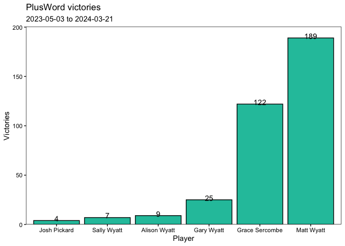
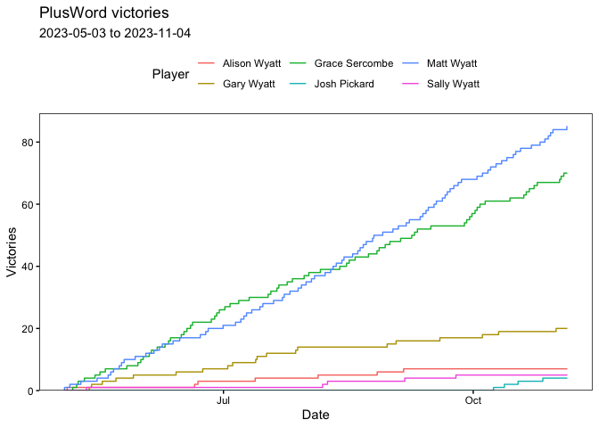
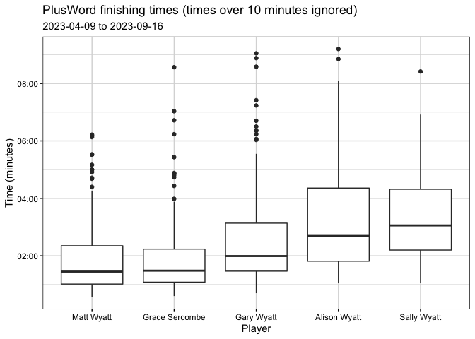
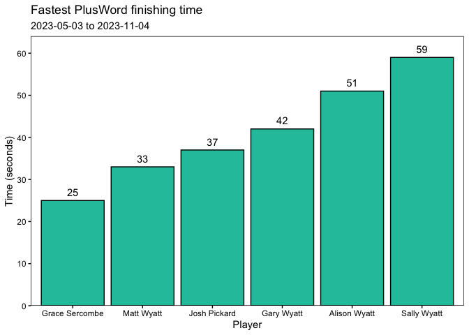
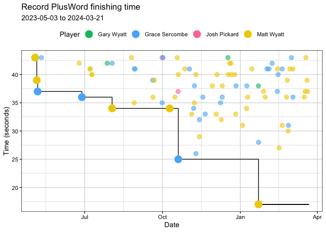
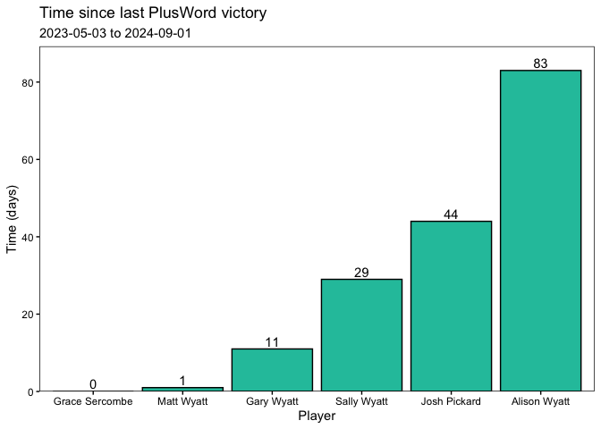

PlusWord Analysis
================

## Overall Ranking

| Player         |   1 |   2 |   3 |   4 |   5 |   6 | Games |
|:---------------|----:|----:|----:|----:|----:|----:|------:|
| Matt Wyatt     |  85 |  63 |  18 |  11 |   4 |   1 |   182 |
| Grace Sercombe |  70 |  50 |  28 |  16 |   0 |   0 |   164 |
| Gary Wyatt     |  20 |  35 |  65 |  37 |  18 |   4 |   179 |
| Alison Wyatt   |   7 |  24 |  42 |  67 |  29 |   4 |   173 |
| Sally Wyatt    |   5 |   4 |  24 |  27 |  46 |   9 |   115 |
| Josh Pickard   |   4 |   5 |   4 |   6 |   6 |   7 |    32 |

Longest winning streaks for each player.

| Player         | Longest streak |
|:---------------|---------------:|
| Grace Sercombe |              5 |
| Matt Wyatt     |              5 |
| Alison Wyatt   |              2 |
| Gary Wyatt     |              2 |
| Josh Pickard   |              1 |
| Sally Wyatt    |              1 |

## Player Times

Ten fastest times overall.

| Rank | Player         | Date       | Time (s) |
|-----:|:---------------|:-----------|---------:|
|    1 | Grace Sercombe | 2023-10-19 |       25 |
|    2 | Matt Wyatt     | 2023-11-04 |       33 |
|    3 | Matt Wyatt     | 2023-08-02 |       34 |
|    3 | Matt Wyatt     | 2023-10-09 |       34 |
|    5 | Matt Wyatt     | 2023-08-28 |       35 |
|    5 | Grace Sercombe | 2023-09-30 |       35 |
|    7 | Grace Sercombe | 2023-06-27 |       36 |
|    7 | Matt Wyatt     | 2023-09-19 |       36 |
|    7 | Matt Wyatt     | 2023-10-15 |       36 |
|   10 | Grace Sercombe | 2023-05-06 |       37 |
|   10 | Josh Pickard   | 2023-10-19 |       37 |

## Time since last win

