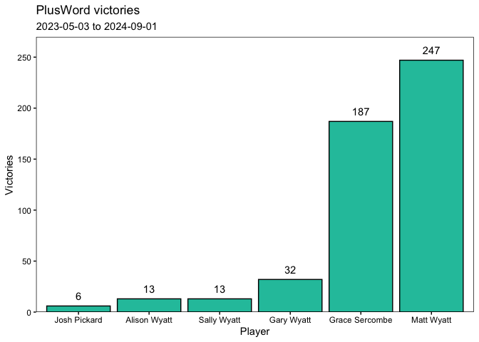
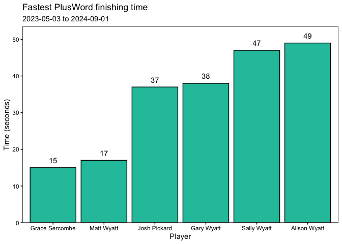

# PlusWord Analysis

## Overall Ranking

| Player         |   1 |   2 |   3 |   4 |   5 |   6 |   7 | Games |
|:---------------|----:|----:|----:|----:|----:|----:|----:|------:|
| Matt Wyatt     | 189 | 119 |  35 |  25 |   6 |   1 |   0 |   375 |
| Grace Sercombe | 122 |  95 |  36 |  22 |   7 |   1 |   0 |   283 |
| Gary Wyatt     |  25 |  45 | 100 |  96 |  34 |  13 |   0 |   313 |
| Alison Wyatt   |   9 |  36 |  70 |  81 |  85 |  17 |   0 |   298 |
| Sally Wyatt    |   7 |  11 |  37 |  61 |  58 |  36 |   0 |   210 |
| Josh Pickard   |   4 |  13 |  16 |  14 |  17 |  12 |   1 |    77 |

Longest winning streaks for each player.

| Player         | Longest streak |
|:---------------|---------------:|
| Matt Wyatt     |              8 |
| Grace Sercombe |              5 |
| Alison Wyatt   |              2 |
| Gary Wyatt     |              2 |
| Josh Pickard   |              1 |
| Sally Wyatt    |              1 |

## Player Times

Ten fastest times overall.

| Rank | Player         | Date       | Time (s) |
|-----:|:---------------|:-----------|---------:|
|    1 | Matt Wyatt     | 2024-01-22 |       17 |
|    2 | Grace Sercombe | 2023-10-19 |       25 |
|    3 | Grace Sercombe | 2023-11-09 |       26 |
|    4 | Matt Wyatt     | 2024-02-15 |       27 |
|    5 | Grace Sercombe | 2024-01-22 |       28 |
|    6 | Matt Wyatt     | 2023-11-13 |       29 |
|    7 | Matt Wyatt     | 2024-02-26 |       30 |
|    8 | Matt Wyatt     | 2024-01-03 |       31 |
|    8 | Matt Wyatt     | 2024-02-19 |       31 |
|    8 | Grace Sercombe | 2024-02-26 |       31 |

## Time since last win

