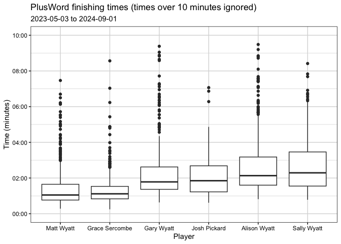

# PlusWord Analysis

## Overall Ranking

| Player         |   1 |   2 |   3 |   4 |   5 |   6 | Games |
|:---------------|----:|----:|----:|----:|----:|----:|------:|
| Matt Wyatt     | 247 | 139 |  40 |  30 |   9 |   1 |   466 |
| Grace Sercombe | 187 | 151 |  51 |  22 |   1 |   1 |   413 |
| Gary Wyatt     |  32 |  89 | 169 | 122 |  44 |  14 |   470 |
| Alison Wyatt   |  13 |  57 | 116 | 151 |  95 |  17 |   449 |
| Sally Wyatt    |  13 |  21 |  73 |  83 |  91 |  28 |   309 |
| Josh Pickard   |   6 |  24 |  22 |  23 |  24 |  16 |   115 |

Longest winning streaks for each player.

| Player         | Longest streak |
|:---------------|---------------:|
| Matt Wyatt     |              8 |
| Grace Sercombe |              6 |
| Alison Wyatt   |              2 |
| Gary Wyatt     |              2 |
| Josh Pickard   |              1 |
| Sally Wyatt    |              1 |

## Player Times

Ten fastest times overall.

| Rank | Player         | Date       | Time (s) |
|-----:|:---------------|:-----------|---------:|
|    1 | Grace Sercombe | 2024-06-01 |       15 |
|    2 | Matt Wyatt     | 2024-01-22 |       17 |
|    2 | Matt Wyatt     | 2024-07-11 |       17 |
|    2 | Matt Wyatt     | 2024-08-29 |       17 |
|    5 | Matt Wyatt     | 2024-07-08 |       19 |
|    6 | Matt Wyatt     | 2024-05-28 |       23 |
|    7 | Grace Sercombe | 2023-10-19 |       25 |
|    7 | Matt Wyatt     | 2024-04-17 |       25 |
|    7 | Matt Wyatt     | 2024-06-01 |       25 |
|   10 | Grace Sercombe | 2023-11-09 |       26 |

## Time since last win

